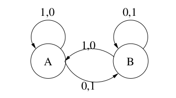

#	Code repository for multi objective VI / BRTDP.
## Dependencies: c++17, cmake 3.12, Eigen 3.3 (sparse matrices)

## Installing the eigen library on Debian/Ubuntu can be done by running:
	 $ sudo apt-get install libeigen3-dev

## Afterwards simply run:
	 $ mkdir build
	 $ cd build
	 $ cmake ..
	 $ make

###### The final binary is located at build/mo-brtdp, tests at build/mo-brtdp-tests

## Current features

* General MDP class implemented using sparse matrices.

* Support for 1 or 2 reward dimensions / pareto curves.

* BRTDP algorithm implementation that uses both of the above, keeps lower and
* upper bounds on objective for each state/action pair - pareto curves. Accepts
discount parameters / precision on hausdorff distance of starting bound. 

* Heuristics for BRTDP for successor sampling ( difference of bounds as
in the original paper ). 

* Parser for explicit PRISM files with some additional features that can be used to load
explicit models and use them to build the MDP for solving.

## Code structure

* Pareto curves, hausdorff distance, convex hull - etc. - /include/geometry/
* MDPS, environment interaction - /include/models/
* BRTDP, heuristics - /include/solvers/brtdp.hpp
* PRISM parser - /include/parser.hpp & /src/parser.cpp

## Parser

The file format is described in depth here: [PRISM Format Description](https://www.prismmodelchecker.org/manual/Appendices/ExplicitModelFiles)
, see Transition ( .tra ) files and Transition Reward ( .trew ) files. 

It is also possible to supply more than one dimension of rewards in one file for any transition.

* Original PRISM format:
	+ 1 0 2 6 - transition from 1 under action 0 to state 2 has reward 6

* Additionally supported:
	+ 1 0 2 6 3 - transition has reward (6, 3)

More details on the parser ( all the things that are checked, etc. ) are given
in the source file.

## Using the tool

No CLI for now, but running the solver on an MDP of your choice can be done as
follows.

1. Create a transition file and ( possibly multiple ) transition reward files
	 that describe your MDP in the build directory.
2. Use the test_brtdp() function provided in the main source file.
3. The function outputs the resulting bounds ( pareto objects ) to stdout and
	 to two text files starting_upper and starting_lower respectively.

## Changes made to the algorithm
Since stochastic policies are considered as well, I've changed the algorithm to
only keep vertices of the convex hull after every update, see section *Update
step* in the main pdf. 

This is advantageous for performance, since it helps
eliminate unnecessary ( linearly dependent, etc. ) points during the updates.
The proofs should remain unaffected by this change. To give an example:
.

Computing the pareto front(s) of this simple MDP when using a high discount
parameter was computationally infeasible without eliminating dependent points. 
Moving the convex hull operator in the update is enough to overcome this.

